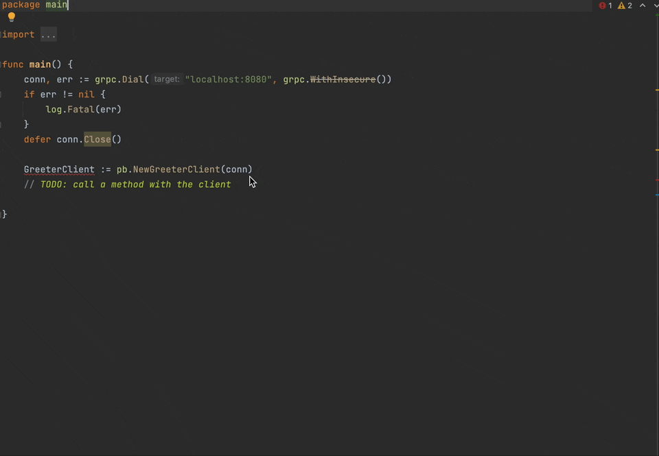

# Welcome to the Alis Build platform

>**_"Our job as builders is to create the world as it could be."_** - <a href="https://farmerandfarmer.org/mastery/builder.html" target="_blank">Sep Kamvar</a>

The Alis Build platform enables individuals and organisations to transform ideas into scalable, enterprise-grade digital services.

High-quality software needs to be scalable, readily accessible, secure, easy-to-use and interoperable with other digital services. The costs and expertise associated with these requirements are exacting, particularly at scale, which present high barriers to entry for individuals and organisations.

The technologies and standards already exist to lower these barriers, but they are disjointed and require a lot of effort to consolidate and effectively leverage before the value is realised. We have done the work of thinking through these complex problems, identifying the best-in-class open-source technologies and standards, and brought these together for the users of the platform.

Our aim is to democratise building software, enabling anyone to build their own innovation through the simple steps of
_define, implement and consume_.

## Experience it yourself

Experience the simplicity of _define, implement and consume_ that is Alis Build enables by following
the example.

This example is derived from the [gRPC quickstart documentation](https://grpc.io/docs/languages/go/quickstart/).

### Before you start

1. Ensure that you have installed the [Alis CLI](command-line-interface.md)
2. From your terminal, create a new directory and navigate to it

<tabs>
<tab name="MacOS/Linux">

```bash
mkdir helloworld
cd helloworld
```
</tab>
<tab name="Windows">

```bash
md helloworld
cd helloworld
```
</tab>
</tabs>

## 1. Define

In the _define_ step, we use [Protocol Buffers](../references/resource-oriented-design.md#protocol-buffers) to
define all resources and services that we use.

From your terminal, run the command:
```bash
alis proto init helloworld.v1
```

The response should be similar to that shown below.


The above command added a `service.proto` file in the `helloworld` directory. Edit this file to contain
the content shown below.

```protobuf
syntax = "proto3";

package helloworld.v1;

option go_package = "google.golang.org/grpc/examples/helloworld/helloworld/v1";

// The greeting service definition.
service Greeter {
  // Sends a greeting
  rpc SayHello (HelloRequest) returns (HelloReply) {}
}

// The request message containing the user's name.
message HelloRequest {
  // The name of the user
  string name = 1;
}

// The response message containing the greetings
message HelloReply {
  // The greeting message
  string message = 1;
}
```

Now that everything is defined, we can implement the service.

## 2. Implement

Having a well-defined source of truth in the form of the proto file,
allows for the auto-generation of language-specific type definitions and scaffolding
for adding business logic, amongst other benefits. These features make it simple for
developers to only focus on adding business logic.

We will leverage these to implement the `Greeter` service by running the following command
and selecting one or more of auto-generated options provided.
```bash
alis proto gen boilerplate
```

:::warning
The above command requires you to be in a directory containing a single proto file,
ie. the `helloworld` directory containing the `service.proto` file.
:::

The flow should be similar to that depicted below, in which only `Go` was selected.


This commands adds a set of `server` and `client` boilerplate files in the `helloworld` directory,
under the selected languages that contains boilerplate code such as to only add the business logic.

To implement the logic, open the desired language directory in your IDE and follow the steps below.

<tabs>
<tab name="Go">

1. Ensure that you have executed `go mod tidy` in the `server` directory

2. Open the `server/methods.go` file and fill in the logic as follows:


:::details Complete file

```go
	package main

	import (
		"context"

		pb "helloworld.v1/internal/protobufs"
	)

	type myGreeter struct {
		pb.UnimplementedGreeterServer
	}

	func (s *myGreeter) SayHello(ctx context.Context, req *pb.HelloRequest) (*pb.HelloReply, error) {
		msg := "Hello, " + req.GetName()

		return &pb.HelloReply{Message: msg}, nil
	}

```

:::

</tab>
</tabs>

Notice how the definitions from the `service.proto` file travels with the code. This
greatly boosts developer productivity as:
1. The _define_ step, which contains the documentation, is not an afterthought but is integral to the development process.
2. These definitions are shipped with the code, providing developers with the types and documentation they require in their IDE.

Both these factors contribute to enforcing good development practices and greatly improves
developer and business productivity.

## 3. Consume

Similar to the server, Alis Build also auto-generates type definitions for the supported languages,
making consumption of services feel native.

Add simple logic in your language of choice to consume the `greeter` service.

<tabs>
<tab name="Go">

1. Ensure that you have executed `go mod tidy` in the `client` directory

2. Open the `client/main.go` file and fill in the logic as follows:



:::details Complete file

```go
package main

import (
	"context"
	"fmt"
	"log"

	pb "client/internal/protobufs"
	"google.golang.org/grpc"
)

func main() {
	conn, err := grpc.Dial("localhost:8080", grpc.WithInsecure())
	if err != nil {
		log.Fatal(err)
	}
	defer conn.Close()

	GreeterClient := pb.NewGreeterClient(conn)
	resp, _ := GreeterClient.SayHello(context.Background(), &pb.HelloRequest{Name: "Bob"})

	fmt.Println(resp.GetMessage())

}

```

:::

</tab>
</tabs>


## Test it out

Now that we have _defined_ our service; _implemented_ the logic; and added code for the _consumption_, we can now
spin up the server and make a hit from the client to see this in action.

<tabs>
<tab name="Go">

### Start the server

1. Open the terminal in the `helloworld/go/server` directory
2. Run the command `go run *.go`, which should give a response similar to that below.


### Consume the service

1. Open the terminal in the `helloworld/go/client` directory
2. Run the command `go run *.go`, which should give a response similar to that below.


</tab>
</tabs>

## Support for additional languages

We are constantly working on expanding the auto-generated functionality such as demonstrated above.

While we may not have full code boilerplate generation support for all available languages, you are still able
to generate type definitions for a wider range of languages.

### Test it out

In your terminal, run the following command to generate the types:

```bash
alis proto gen types
```

The flow should be similar to that below.


These can now be imported in your codebase to leverage the power of the definition-first approach.

## Want to see more?

:::info Note
The rest of the documentation is primarily geared towards [Alis Build Enterprise](https://alisx.com/#:~:text=Enterprise), which gives the simple process
of define, implement and consume superpowers by providing a complete cloud development framework for teams and organisations.
:::

### Design and implement digital services
The Alis Build platform gives you and your organisation software development superpowers. [Experience what we make possible](developer-flow.md).

### Consume digital services
We aim to ensure that how software across the platform operates, communicates and integrates is simple and consistent. [Find out more and experience it yourself](consumer-experience.md).

### Configure your device
Already joined Alis Build? Follow the guides to set up your local environment, starting off with our [command line interface](command-line-interface.md).

#### Get in touch
Have any further questions? Or want to schedule a demo? <a href="https://alis.exchange/signup" target="_blank">Get in touch</a>.